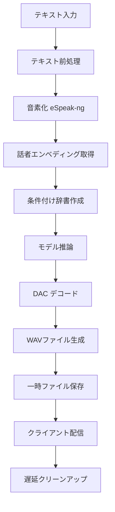
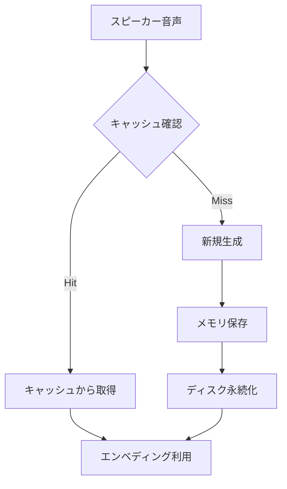

# システムパターンとアーキテクチャ

## 全体アーキテクチャ

### レイヤー構成

```
┌─────────────────────────────────────────────────────────────┐
│                    Frontend Layer                           │
│  Next.js + React + Material-UI + TypeScript                │
│                   (web/src/)                                │
└─────────────────────────────────────────────────────────────┘
                              │ HTTP/REST
┌─────────────────────────────────────────────────────────────┐
│                      API Layer                             │
│         FastAPI + Pydantic + AsyncIO                       │
│                   (app/api/)                               │
└─────────────────────────────────────────────────────────────┘
                              │
┌─────────────────────────────────────────────────────────────┐
│                   Service Layer                            │
│     Model Manager + Cache + Audio Utils                    │
│                  (app/core/, app/utils/)                   │
└─────────────────────────────────────────────────────────────┘
                              │
┌─────────────────────────────────────────────────────────────┐
│                    Model Layer                             │
│    Zonos Model + Speaker Cloning + Conditioning            │
│                   (zonos/)                                 │
└─────────────────────────────────────────────────────────────┘
                              │
┌─────────────────────────────────────────────────────────────┐
│                Infrastructure Layer                        │
│   PyTorch + CUDA + eSpeak-ng + Hugging Face               │
└─────────────────────────────────────────────────────────────┘
```

## 主要コンポーネント

### 1. Zonos Core Engine (`zonos/`)

**責務**: 音声合成の核となる機能

- **model.py**: Zonosモデルのメインクラス
- **conditioning.py**: テキスト前処理と条件設定
- **speaker_cloning.py**: 話者エンベディング生成
- **autoencoder.py**: DACオートエンコーダー
- **backbone/**: TransformerとHybridバックボーン

**重要な設計パターン**:

- **Factory Pattern**: モデル種別に応じたバックボーン選択
- **Strategy Pattern**: 異なるコンディショニング手法
- **Cache Pattern**: スピーカーエンベディングのメモリ内キャッシュ

### 2. Application Service Layer (`app/`)

**責務**: ビジネスロジックとAPI提供

- **main.py**: FastAPIアプリケーション初期化
- **config.py**: 環境変数とグローバル設定
- **api/router.py**: RESTエンドポイント定義
- **api/tts.py**: 音声合成処理ロジック

**アーキテクチャパターン**:

- **Dependency Injection**: モデルマネージャーの注入
- **Repository Pattern**: キャッシュデータ管理
- **Command Pattern**: 非同期タスク処理

### 3. Core Management (`app/core/`)

**責務**: システムリソース管理

- **model_manager.py**: モデルライフサイクル管理
- **cache.py**: データキャッシング戦略

**パターン**:

- **Singleton Pattern**: モデルインスタンス管理
- **Lazy Loading**: 初回利用時のモデル読み込み
- **Observer Pattern**: リソースクリーンアップ

### 4. Frontend Interface (`web/`)

**責務**: ユーザーインターフェース

- **app/page.tsx**: メインページコンポーネント
- **app/layout.tsx**: アプリケーションレイアウト
- **theme.ts**: Material-UIテーマ設定

## 重要な技術的決定

### 1. モデル管理戦略

**決定**: グローバルシングルトンでモデル管理
**理由**:

- GPU メモリの効率的利用
- アプリケーション起動時の初期化
- 複数リクエスト間でのモデル共有

**実装**:

```python
# app/core/model_manager.py
model = None  # グローバル変数
default_speaker = None

async def initialize_model():
    global model, default_speaker
    model = Zonos.from_pretrained(repo_id)
    default_speaker = cached_speaker_embedding(model, speaker_path)
```

### 2. キャッシュ階層化

**決定**: 3層キャッシュ戦略
**理由**: パフォーマンス最適化と資源効率

**実装**:

1. **メモリ内キャッシュ**: スピーカーエンベディング
2. **ディスクキャッシュ**: Pickleファイル永続化
3. **Hugging Face キャッシュ**: モデルファイル

### 3. 非同期処理アーキテクチャ

**決定**: FastAPI + AsyncIO
**理由**:

- 長時間の音声生成処理への対応
- 複数リクエストの並行処理
- ストリーミング応答の実現

**実装**:

```python
async def generate_speech_stream():
    async for progress in tts_generator:
        yield json.dumps(progress)
```

### 4. エラー処理とクリーンアップ

**決定**: 自動リソース管理
**理由**:

- 一時ファイルの蓄積防止
- メモリリークの回避
- システム安定性の確保

**実装**:

```python
async def cleanup_temp_file(file_path: str, delay: int = 5):
    await asyncio.sleep(delay)
    if os.path.exists(file_path):
        os.unlink(file_path)
```

## データフロー

### 音声合成プロセス



### キャッシュフロー



## 設計パターンの活用

### 1. Factory Pattern (モデル生成)

```python
BACKBONES = {
    "transformer": TransformerBackbone,
    "hybrid": HybridBackbone,
}

def create_backbone(backbone_type):
    return BACKBONES[backbone_type]()
```

### 2. Strategy Pattern (コンディショニング)

```python
_cond_cls_map = {
    "espeak": EspeakPhonemeConditioner,
    "speaker": PassthroughConditioner,
    "emotion": FourierConditioner,
}
```

### 3. Observer Pattern (進捗通知)

```python
def progress_callback(frame, step, max_steps):
    progress = step / max_steps
    progress_queue.put(progress)
```

## スケーラビリティ考慮

### 水平スケーリング準備

- ステートレスAPI設計
- 外部キャッシュ対応可能
- ロードバランサー対応

### 垂直スケーリング

- GPU メモリ使用量の監視
- バッチサイズの動的調整
- モデル並列化対応

### パフォーマンス最適化

- torch.compile の活用
- CUDA グラフの利用
- メモリプール管理
